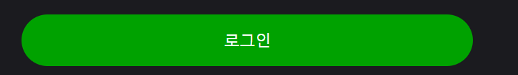

# button 사용법

props의 역할

variant:
버튼의 디자인을 담당합니다 (배경색,글자색,각상태별(hover,active,disabled) 디자인)

size:
버튼의 크기를 담당합니다 (가로,세로 길이, 윤곽선 글자 크기와 간격)

props 리스트

variant : primary | secondary | ghost | profile

size: lg | md | sm | xs | side

full : true

color: roes | orange | yellow | green | cobalt

예시

로그인 페이지

```
<div className="w-[520px]">
    <Button variant="primary" size="lg">
        로그인
    </Button>
</div>
```


