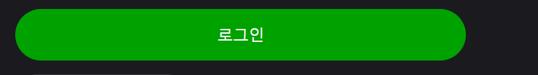

# button 사용법

### props의 역할

variant:
버튼의 디자인을 담당합니다 (배경색,글자색,각상태별(hover,active,disabled) 디자인)

size:
버튼의 크기를 담당합니다 (가로,세로 길이, 윤곽선 글자 크기와 간격)

full:
div 값에 따라 가로 길이를 div에 꽉차게 합니다

color:
버튼의 배경색을 담당합니다 현재는 모달의 컬러버튼 색만 적용했습니다

### props 리스트

variant : primary | secondary | ghost | profile

size: lg | md | sm | xs | side

full : true

color: rose | orange | yellow | green | cobalt

예시

로그인 페이지

```
<div className="w-[520px]">
    <Button variant="primary" size="lg" full={true}>
        로그인
    </Button>
</div>
```



### props 사용방법

1. div의 크기를 지정한다

2. button 컴포넌트를 div 내부에 배치한다

3. 원하는 디자인의 props 사용한다

### 사이드 버튼

사이드 버튼에만 있는 props

- label-대시보드 제목
- hasCrown- 왕관의 유무를 담당합니다
- hasHash- 해시태그를 담당합니다

### 사용법

 <div>
     <SideButton 
        variant="ghost" 
        size="side" 
        label="label" 
        hasCrown={true} 
        hasHash={true}>
       사이드 버튼        
    </SideButton>
 </div>

1. div의 크기 지정

2. button 컴포넌트를 div 내부에 배치한다

3. 원하는 디자인의 props 사용한다

4. 왕관 해시태그의 여부를 boolean 형태로 전달 한다
